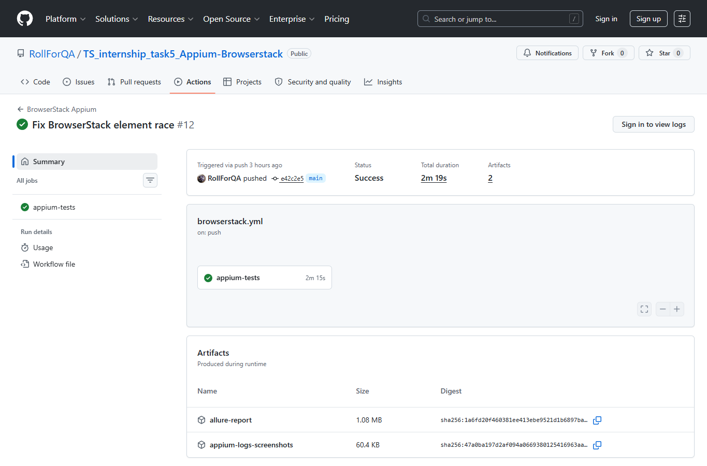
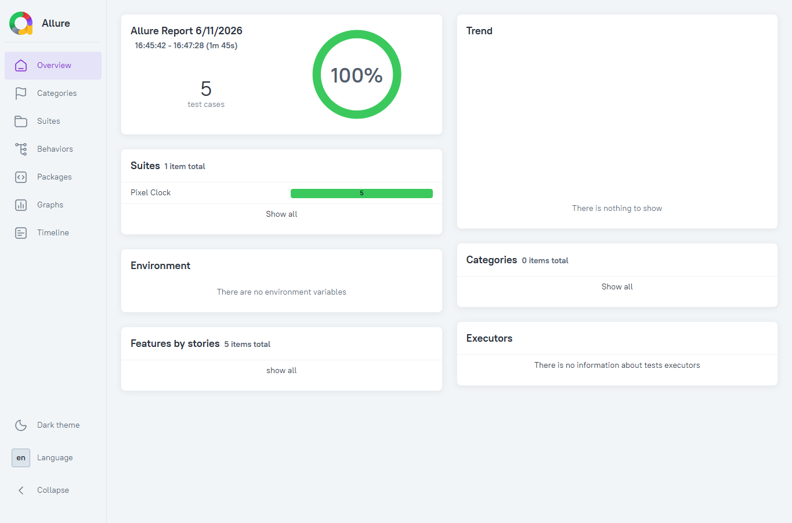

# Pixel Clock Appium Tests

[](https://github.com/RollForQA/TS_internship_task5_Appium-Browserstack/actions/workflows/browserstack.yml)

Mobile automation test project for the native Android Pixel Clock app, built with WebdriverIO, Appium, TypeScript, BrowserStack App Automate, GitHub Actions, and Allure reports.

## Application Under Test

- App: Pixel Clock
- Package: `com.google.android.deskclock`
- Activity: `com.android.deskclock.DeskClock`
- Local device: Android Emulator / Pixel 6 API 34
- BrowserStack device: Samsung Galaxy S23 / Android 13.0

The app was chosen because it is a native Android application with clear Alarm, Clock, Timer, and Stopwatch workflows. It does not require accounts, network access, or external test data.

## Test Coverage

The implemented test cases are documented in [TEST_CASES.md](./TEST_CASES.md).

| ID | Scenario |
| --- | --- |
| TC-01 | Navigate between Alarm, Clock, Timer, and Stopwatch screens |
| TC-02 | Create an alarm with a label |
| TC-03 | Edit an alarm label |
| TC-04 | Start and pause a timer |
| TC-05 | Record and reset a stopwatch lap |

## Project Structure

```text
test/
  screens/       Screen objects for Clock app areas
  specs/         WDIO test specs
  support/       Shared app reset helpers
```

Key config files:

- `wdio.local.conf.ts` - local Android emulator run
- `wdio.browserstack.conf.ts` - BrowserStack App Automate run
- `wdio.shared.conf.ts` - shared WDIO, Mocha, and Allure settings
- `.github/workflows/browserstack.yml` - CI run on GitHub Actions

## Setup

Install dependencies:

```powershell
npm ci
```

Check TypeScript:

```powershell
npm run typecheck
```

For a local emulator run, start an Android emulator or connect a device, then verify it. Pixel emulators normally include Google Clock, so no APK path is required:

```powershell
adb devices -l
npm run test:local
```

To select a specific connected device:

```powershell
$env:ANDROID_DEVICE_NAME = "Pixel_6_API_34"
$env:ANDROID_UDID = "emulator-5554"
npm run test:local
```

For an emulator without Google Clock, place an installable APK at `apps/pixel-clock.apk`. APK files are intentionally ignored by Git. Set the path before running so Appium installs it:

```powershell
$env:ANDROID_APP_PATH = "$PWD\apps\pixel-clock.apk"
npm run test:local
```

The local configuration pins the app language and locale to English/US because several native accessibility labels are locale-dependent.

## BrowserStack Run

The BrowserStack config reads credentials from environment variables. Do not commit real credentials to the repository.

```powershell
$env:BROWSERSTACK_USERNAME = "your_username"
$env:BROWSERSTACK_ACCESS_KEY = "your_access_key"
$env:BROWSERSTACK_APP_ID = "bs://your_app_id"
npm run test:browserstack
```

If the app has not been uploaded yet, upload the ignored local APK and copy the returned `app_url` value into `BROWSERSTACK_APP_ID`:

```powershell
curl.exe -u "$env:BROWSERSTACK_USERNAME`:$env:BROWSERSTACK_ACCESS_KEY" `
  -X POST "https://api-cloud.browserstack.com/app-automate/upload" `
  -F "file=@apps/pixel-clock.apk"
```

BrowserStack removes uploaded apps 30 days after their last use. Re-upload the APK and update the secret if an old `bs://` identifier expires.

Required GitHub repository secrets:

- `BROWSERSTACK_USERNAME`
- `BROWSERSTACK_ACCESS_KEY`
- `BROWSERSTACK_APP_ID`

The GitHub Actions workflow runs on `main` pushes and can also be started manually from the Actions tab.

## Reports

The project uses the WDIO spec reporter and Allure reporter. Existing `allure-results` are cleared automatically before each local or BrowserStack test command.

Generate and open a local Allure report:

```powershell
npm run allure:generate
npm run allure:open
```

In CI, the generated Allure report is uploaded as a GitHub Actions artifact.

## Evidence

- Latest verified GitHub Actions run for the committed suite: [BrowserStack Appium #12](https://github.com/RollForQA/TS_internship_task5_Appium-Browserstack/actions/runs/27340721469)
- Historical BrowserStack public build: [Pixel Clock GitHub Actions CI 27279688569](https://app-automate.browserstack.com/dashboard/v2/public-build/cVN3OXo4Q09hczdQQ1NoelV3b3E4d0dVTnAxMmlIUGt3VGZScktKRzE3Y3V5MTF0bGVsMHp6V0pPNGpUMWxxb2lkbzVmMEhIeW5Ed0NkcHZIV3E2bXc9PS0tb1hJOTIvZjRIUGpubEZra0V4bUt2Zz09--5645d76131c962564a608d8db339a87637b5388e)

The GitHub Actions screenshot shows the latest successful BrowserStack run. The Allure screenshot was generated from a clean local emulator run with all five tests passing.





## Useful Commands

```powershell
npm run typecheck
npm run test:local
npm run test:browserstack
npm run allure:generate
npm run allure:open
npm run appium:doctor
```
